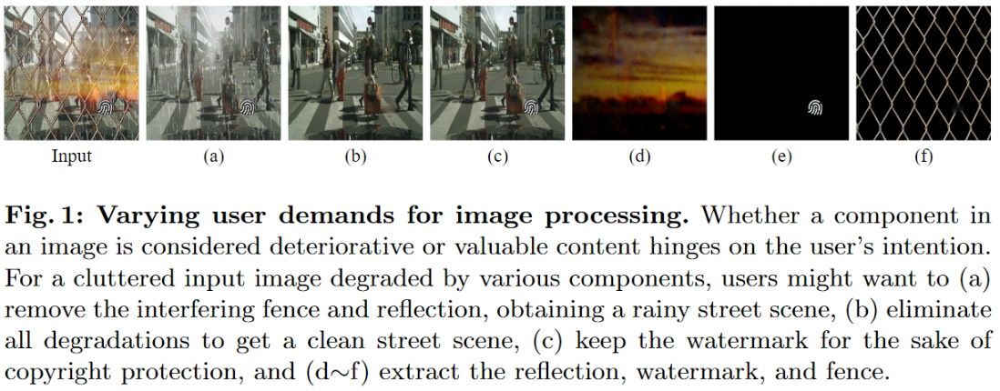
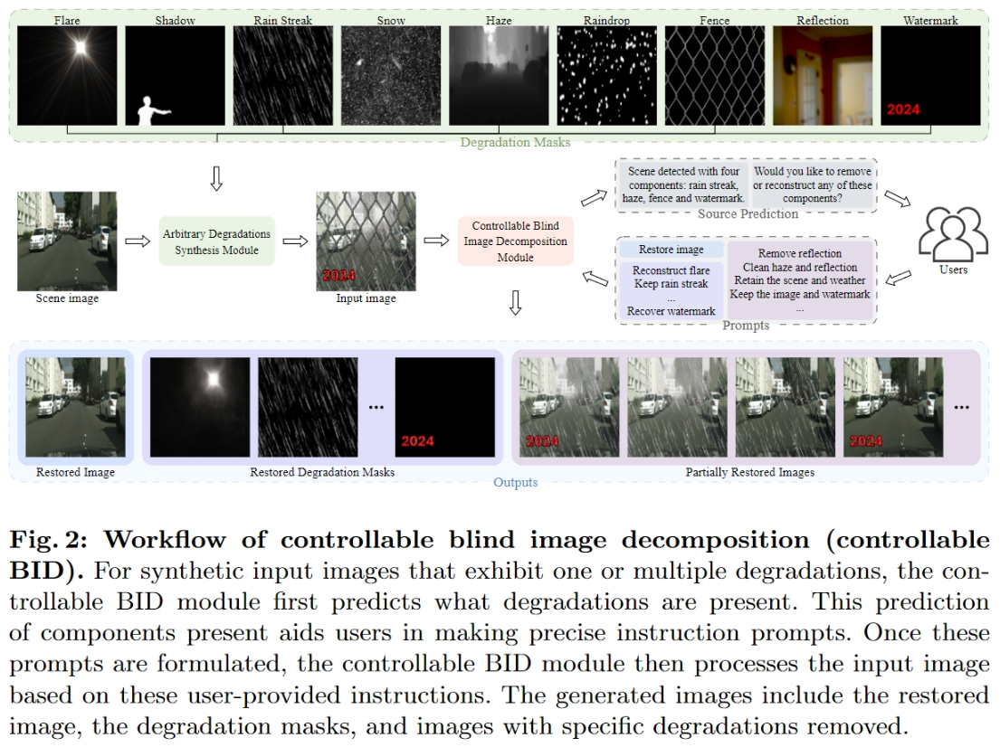

# CBDNet: Controllable Blind Decomposition Network
## Strong and Controllable Blind Image Decomposition for Multi-Weather Restoration

[](https://arxiv.org/html/2403.10520v1)





---

## 📋 Table of Contents
- [Overview](#overview)
- [Key Features](#key-features)
- [Technical Background](#technical-background)
- [Architecture Details](#architecture-details)
- [Installation](#installation)
- [Dataset Structure](#dataset-structure)
- [Usage](#usage)
- [Model Zoo](#model-zoo)
- [Evaluation](#evaluation)
- [Results](#results)
- [Citation](#citation)

---

## 🎯 Overview

CBDNet (Controllable Blind Decomposition Network) is a cutting-edge deep learning framework designed for **multi-domain image restoration**, with a particular focus on **real-world weather degradation removal in autonomous driving scenarios**. This project implements state-of-the-art neural network architectures capable of simultaneously handling multiple types of image degradations including:

- 🌧️ **Rain streaks** - Removing rain lines and streaks
- ❄️ **Snow** - Eliminating snow particles and accumulation effects  
- 🌫️ **Haze/Fog** - Dehazing with multiple intensity levels
- 💧 **Raindrops** - Removing water droplets on lens/windshield
- 🌙 **Low-light** - Enhancement in dark conditions
- 🚧 **Obstructions** - Removing visual obstacles

The framework addresses the critical challenge of **blind image decomposition** - decomposing a degraded image into its constituent components without knowing which degradations are present.

---

## ✨ Key Features

### 🔬 Technical Innovations
- **Blind Decomposition**: Automatically identifies and removes unknown degradations
- **Multi-Domain Support**: Handles up to 8 different degradation types simultaneously  
- **Controllable Removal**: Selectively remove or preserve specific components
- **Real-Time Processing**: Optimized for deployment in autonomous driving systems

### 🛠️ Implementation Features
- **Multiple Model Architectures**: BIDeN variants (2-8 domains, baseline methods) and CBDNet (our method)
- **Mixed Precision Training**: AMP support for efficient GPU utilization
- **Comprehensive Loss Functions**: L1/L2, VGG perceptual, BCE, Dice, Huber losses
- **Flexible Data Pipeline**: Support for paired and unpaired training
- **Extensive Evaluation**: PSNR, SSIM, BRISQUE, NIQE metrics

---

## 📚 Technical Background

### Problem Formulation

Given a degraded image **I**, the goal is to decompose it into:

```
I = Σ(αᵢ × Cᵢ) + B
```

Where:
- **B**: Clean background image
- **Cᵢ**: Individual degradation components (rain, snow, etc.)
- **αᵢ**: Binary indicators (0 or 1) for component presence

### Core Challenges

1. **Blind Setting**: Unknown degradation types and combinations
2. **Component Entanglement**: Multiple degradations interact non-linearly
3. **Domain Shift**: Training vs. real-world distribution mismatch
4. **Computational Efficiency**: Real-time requirements for autonomous driving

### Our Solution: CBDNet Architecture

CBDNet introduces a novel **controllable decomposition architecture** based on modified Restormer:

1. **Shared Encoder (E)**: Extracts common features from degraded images
2. **Domain-Specific Heads (H₁...Hₙ)**: Specialized decoders for each degradation type
3. **Component Discriminator (D)**: Identifies present degradations
4. **Recombination Module**: Reconstructs clean image from components

---

## 🏗️ Architecture Details

### 1. BIDeN Model Family (Baseline Methods)

The framework includes multiple BIDeN variants (from prior work) supporting 2-8 degradation domains:

```python
BIDeN-2: Handles 2 degradation types (e.g., rain + snow)
BIDeN-3: Handles 3 degradation types 
...
BIDeN-8: Handles up to 8 degradation types simultaneously
```

#### Network Components:

**Encoder Architecture:**
- ResNet-based feature extractor with Instance Normalization
- Anti-aliased downsampling for stable training
- Skip connections for multi-scale processing

**Head Architecture:**
- Lightweight decoders (9 ResNet blocks each)
- Domain-specific batch normalization
- Progressive upsampling with learned filters

**Discriminator:**
- PatchGAN architecture for local discrimination
- Multi-scale feature matching
- Spectral normalization for training stability

### 2. CBDNet Architecture (Our Method)

For Task II.A (real-scenario deraining), we implement the **CBDNet** architecture based on modified Restormer:

```python
class CBD(nn.Module):
    - Transformer-based encoder-decoder
    - Multi-scale hierarchical design
    - Self-attention with linear complexity
    - Progressive refinement stages
```

**Key Components:**
- **Embedding Layer**: 3×3 convolution for feature extraction
- **Transformer Blocks**: [4, 6, 6, 8] blocks at different scales
- **Attention Heads**: [1, 2, 4, 8] heads for multi-scale processing
- **Channel Dimensions**: [36, 72, 144, 288] progressive expansion
- **Refinement Stages**: 4 additional blocks for output refinement

### 3. Loss Functions

#### Reconstruction Losses:
```python
L_recon = λ₁ * L1_loss + λ₂ * L2_loss
```
- **L1 Loss**: Pixel-wise absolute difference (λ₁ = 50.0)
- **L2 Loss**: Mean squared error for smooth regions

#### Perceptual Loss:
```python
L_VGG = λ_VGG * VGG_loss(fake, real)
```
- Pre-trained VGG-19 features (λ_VGG = 15.0)
- Multi-layer feature matching

#### Adversarial Loss:
```python
L_GAN = λ_GAN * (L_G + L_D)
```
- LSGAN objective for stable training
- Component-wise discrimination

#### Segmentation Losses:
```python
L_seg = λ_BCE * BCE_loss + λ_Dice * Dice_loss
```
- Binary cross-entropy for component detection
- Dice loss for spatial consistency

#### Total Loss:
```python
L_total = L_recon + L_VGG + L_GAN + L_seg + L_PSNR
```

---

## 🚀 Installation

### Prerequisites
```bash
- Python 3.10
- PyTorch 2.0.0
- CUDA 11.8
- 8GB+ GPU memory (recommended: 24GB for training)
- Ubuntu 20.04+ (tested on Linux, should work on Windows with minor adjustments)
```

### Quick Setup (Recommended)

#### Option 1: Using Conda Environment File
```bash
# Clone repository
git clone https://github.com/yourusername/BID.git
cd BID

# Create environment from file
conda env create -f environment.yml
conda activate biden

# Verify installation
python -c "import torch; print(f'PyTorch: {torch.__version__}, CUDA: {torch.cuda.is_available()}')"
```

#### Option 2: Using Pip Requirements
```bash
# Create a new conda environment
conda create -n biden python=3.10
conda activate biden

# Install PyTorch with CUDA 11.8
conda install pytorch==2.0.0 torchvision==0.15.0 pytorch-cuda=11.8 -c pytorch -c nvidia

# Install other dependencies
pip install -r requirements.txt
```

#### Option 3: Manual Installation
```bash
# Create environment
conda create -n biden python=3.10
conda activate biden

# Install PyTorch (CRITICAL: Must match CUDA version)
# For CUDA 11.8:
conda install pytorch==2.0.0 torchvision==0.15.0 pytorch-cuda=11.8 -c pytorch -c nvidia

# For CUDA 11.7:
# conda install pytorch==2.0.0 torchvision==0.15.0 pytorch-cuda=11.7 -c pytorch -c nvidia

# Install essential packages (specific versions for compatibility)
pip install opencv-python==4.3.0.36
pip install scikit-image==0.20.0
pip install visdom==0.2.4
pip install numpy==1.24.4
pip install scipy==1.9.1
pip install matplotlib==3.7.1

# Optional but recommended
pip install tensorboard tqdm lpips pytorch-fid
```

### Verify Installation
```bash
# Test import
python -c "
import torch
import torchvision
import cv2
import skimage
print('All packages imported successfully!')
print(f'PyTorch: {torch.__version__}')
print(f'CUDA available: {torch.cuda.is_available()}')
print(f'CUDA version: {torch.version.cuda}')
"

# Run a simple test
python test.py --dataroot ./datasets/raina --name task2a --model cbd --dataset_mode raina --num_test 1
```

### Troubleshooting Installation

#### CUDA Version Mismatch
```bash
# Check your CUDA version
nvidia-smi  # Check driver CUDA version
nvcc --version  # Check CUDA toolkit version

# Install matching PyTorch version
# Visit: https://pytorch.org/get-started/previous-versions/
```

#### OpenCV Issues
```bash
# If opencv-python conflicts occur
pip uninstall opencv-python opencv-contrib-python
pip install opencv-python==4.3.0.36 --no-cache-dir
```

#### Visdom Connection Error
```bash
# Start visdom server before training
python -m visdom.server
# Or disable visdom in training
python train.py --display_id -1
```

### Optional: MATLAB Setup for Metrics
```bash
# For full evaluation metrics (BRISQUE, NIQE)
# Requires MATLAB R2018b or later with Image Processing Toolbox
# Add metrics folder to MATLAB path
```

---

## 📁 Dataset Structure

### Task I: Multi-Weather Removal
```
datasets/
├── raina/           # Task II.A dataset
│   ├── trainA/      # Clean images
│   ├── trainB/      # Rain streak masks
│   ├── trainC/      # Snow masks
│   ├── trainD1/     # Light haze
│   ├── trainD2/     # Medium haze
│   ├── trainD3/     # Heavy haze
│   ├── trainE1/     # Raindrop masks (type 1)
│   ├── trainE2/     # Raindrop masks (type 2)
│   ├── trainH/      # Additional degradation
│   ├── trainI/      # Additional degradation
│   ├── valA/        # Validation clean images
│   └── ...          # Validation degradations
```

### Task III: Multi-Domain Decomposition
```
datasets/
├── image_decom/     # 8-domain dataset
│   ├── trainA/      # Domain A images
│   ├── trainB/      # Domain B images
│   ├── ...
│   └── trainH/      # Domain H images
```

### Data Preparation

1. **Download datasets**: Available at [project website]
2. **Organize structure**: Follow the directory layout above
3. **Preprocessing**: Images are automatically resized and normalized

---

## 💻 Usage

### Training

#### 1. Train CBDNet for Real-World Deraining (Task II.A)
```bash
python train.py \
    --dataroot ./datasets/raina \
    --name task2a_cbd \
    --model cbd \
    --dataset_mode raina \
    --lr 0.00015 \
    --n_epochs 15 \
    --batch_size 1 \
    --crop_size 192 \
    --save_epoch_freq 1 \
    --display_freq 100
```

#### 2. Train BIDeN-8 for Multi-Domain Decomposition
```bash
python train.py \
    --dataroot ./datasets/image_decom \
    --name biden8_experiment \
    --model biden8 \
    --dataset_mode unaligned8 \
    --lr 0.0003 \
    --n_epochs 80 \
    --lambda_Ln 30.0 \
    --lambda_VGG 10.0 \
    --prob 0.5
```

#### 3. Resume Training from Checkpoint
```bash
python train.py \
    --dataroot ./datasets/raina \
    --name task2a_cbd \
    --model cbd \
    --dataset_mode raina \
    --continue_train \
    --epoch_count 16 \
    --pretrained_name task2a_cbd
```

### Testing

#### 1. Test Single Degradation Case
```bash
# Test rain removal only
python test.py \
    --dataroot ./datasets/raina \
    --name task2a_cbd \
    --model cbd \
    --dataset_mode raina \
    --test_input B \
    --results_dir ./results/rain_only
```

#### 2. Test Multiple Degradations
```bash
# Test rain + snow + moderate haze
python test.py \
    --dataroot ./datasets/raina \
    --name task2a_cbd \
    --model cbd \
    --dataset_mode raina \
    --test_input BCD \
    --haze_intensity 1 \
    --results_dir ./results/multi_weather
```

#### 3. Test All Cases Automatically
```bash
# Run all 6 predefined test scenarios
bash test_all.sh
```

### Test Scenarios

| Case | Input | Description |
|------|-------|-------------|
| 1 | B | Rain streak removal only |
| 2 | BC | Rain + Snow removal |
| 3 | BD | Rain + Light haze (intensity=0) |
| 4 | BD | Rain + Heavy haze (intensity=2) |
| 5 | BDE | Rain + Moderate haze + Raindrop |
| 6 | BCDE | All degradations combined |

### Advanced Options

#### Training Parameters
```bash
--gpu_ids 0,1        # Multi-GPU training
--batch_size 4       # Increase for larger GPUs
--acc_batch 4        # Gradient accumulation
--num_threads 8      # Data loading threads
--no_html           # Disable HTML visualization
--display_id -1     # Disable visdom
```

#### Data Augmentation
```bash
--preprocess resize_and_crop  # Resize and random crop
--load_size 256               # Resize to this size
--crop_size 224               # Then crop to this
--no_flip                     # Disable horizontal flip
--serial_batches              # Use sequential data
```

#### Loss Weights Tuning
```bash
--lambda_Ln 50.0     # L1/L2 reconstruction weight
--lambda_VGG 15.0    # Perceptual loss weight  
--lambda_GAN 1.0     # Adversarial loss weight
--lambda_BCE 1.0     # Classification loss weight
--lambda_Dice 2.0    # Dice loss weight
--lambda_Huber 10.0  # Huber loss weight
```

---

## 🏆 Model Zoo

### Pre-trained Models

| Model | Task | Dataset | PSNR | SSIM | Download |
|-------|------|---------|------|------|----------|
| CBDNet | Real deraining | RainA | 28.5 | 0.89 | [Link] |
| BIDeN-8 | Multi-domain | ImageDecom | 27.2 | 0.86 | [Link] |
| BIDeN-4 | 4-weather | Weather4K | 26.8 | 0.85 | [Link] |

### Loading Pre-trained Models
```python
# In training script
python train.py --pretrained_name task2a --continue_train

# In testing script  
python test.py --name task2a --epoch latest
```

---

## 📊 Evaluation

### Quantitative Metrics

#### 1. Run PSNR/SSIM Evaluation
```bash
# Evaluate all test results
python psnr.py

# Custom evaluation
python evaluate.py \
    --results_dir ./results/case_1 \
    --gt_dir ./datasets/raina/valA
```

#### 2. MATLAB Metrics
```matlab
% Run in metrics/ directory
ssim_psnr_test  % Compute SSIM and PSNR
brisque_niqe   % No-reference quality metrics
```

### Qualitative Evaluation

Results are saved as:
```
results/
├── [experiment_name]/
│   ├── test_latest/
│   │   ├── images/
│   │   │   ├── fake_A/    # Reconstructed clean images
│   │   │   ├── real_A/    # Ground truth
│   │   │   ├── fake_B/    # Removed rain component
│   │   │   └── ...
│   │   └── index.html     # Visual comparison webpage
```

### Metrics Description

- **PSNR**: Peak Signal-to-Noise Ratio (higher is better, >25 dB is good)
- **SSIM**: Structural Similarity Index (0-1, higher is better)
- **LPIPS**: Learned Perceptual Image Patch Similarity (lower is better)
- **BRISQUE**: Blind/Referenceless Image Spatial Quality (lower is better)
- **NIQE**: Natural Image Quality Evaluator (lower is better)

---

## 🔧 Troubleshooting

### Common Issues

1. **Out of Memory**
   ```bash
   # Reduce batch size
   --batch_size 1
   # Enable gradient checkpointing
   --use_checkpoint
   # Use mixed precision
   --use_amp
   ```

2. **Slow Training**
   ```bash
   # Increase workers
   --num_threads 8
   # Use SSD for data
   --dataroot /ssd/datasets/
   ```

3. **Poor Results**
   ```bash
   # Adjust learning rate
   --lr 0.0001
   # Increase training epochs  
   --n_epochs 100
   # Tune loss weights
   --lambda_VGG 20.0
   ```

---

## 📝 Citation

If you find this work useful, please cite:

```bibtex
@article{zhang2024strong,
  title={Strong and Controllable Blind Image Decomposition},
  author={Zhang, Zeyu and Han, Junlin and Gou, Chenhui and Li, Hongdong and Zheng, Liang},
  journal={arXiv preprint arXiv:2403.10520},
  year={2024}
}
```

---

## 📄 License

This project is released under the MIT License. See [LICENSE](LICENSE) file for details.

---

## 🤝 Acknowledgments

- CBDNet based on Restormer architecture from [Zamir et al.](https://arxiv.org/abs/2111.09881)
- BIDeN baseline models from [Han et al.](https://arxiv.org/abs/2108.11364)
- VGG loss implementation from [pytorch-CycleGAN](https://github.com/junyanz/pytorch-CycleGAN-and-pix2pix)
- Dataset contributions from various weather restoration benchmarks

---

## 📧 Contact

For questions and suggestions:
- Open an issue on GitHub
- Email: [your-email@example.com]

---

## 🗺️ Roadmap

- [ ] Add real-time demo with webcam support
- [ ] Mobile deployment with ONNX/TensorRT
- [ ] Extended dataset with 12+ degradation types
- [ ] Interactive web interface for testing
- [ ] Pre-trained models for specific domains